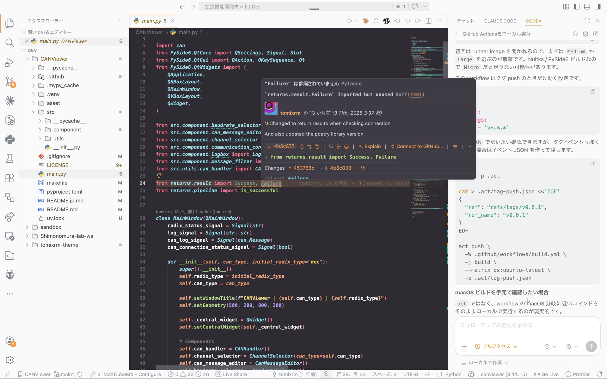

<!-- markdownlint-disable -->

  

<h1 align="center">tomixrm Theme</h1>

<em>Code is dark. Workspace is light. Separate thinking from operating.</em>

  
  

 

  

 

## Concept

A theme that draws a clear boundary between where you write code and where you operate your workspace.
The editor area stays dark for focused, distraction-free coding, while the sidebar and UI stay light for clear navigation and file management.
By separating "thinking space" from "operating space" through color, cognitive load is reduced and context-switching becomes effortless.
Syntax colors are inspired by Monokai for a familiar and visually balanced experience.

## Installation

1. Open **Extensions** in VS Code (`Ctrl+Shift+X`)
2. Search for `tomixrm`
3. Click **Install**
4. Open the Command Palette (`Ctrl+Shift+P`) → **Preferences: Color Theme** → select **tomixrm**

## License

MIT
